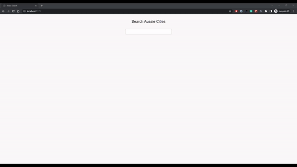

# React Search

Using React and JSON data derived from PHP-MYSQL to implement search functionality.

- Backend - the back-end data is handled by the folder **react-search-backend**. You may want to move the folder to your local **XAMPP/WAMP** folder or your Apache server and then upload the **db.sql** file into your MySQL database.
- The URL endpoint for this exercise was http://localhost/reach-search-backend/, with the request being returned by **index.php**
- Using React and states, we use the JS **fetch()** API to make the call to the endpoint and then display the results.

## Demo

## Data Endpoint

